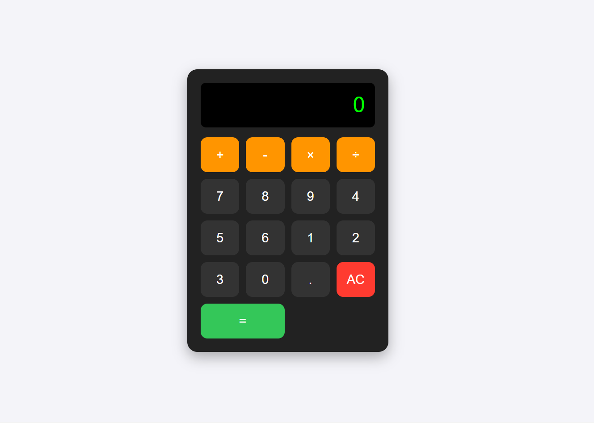

🔢 Simple Calculator

A simple web-based calculator built using HTML, CSS, and JavaScript.
It performs basic arithmetic operations with a clean, responsive UI.

🚀 Features
- Addition, Subtraction, Multiplication, Division
- AC button to clear the display
- Decimal point support
- Dark-themed interface with hover effects

📂 Project Structure

- index.html → Calculator layout
- style.css → Styling for design
- script.js → JavaScript logic

🛠️ Technologies
- HTML5
- CSS3
- JavaScript (ES6)

📸 Screenshot
  

📌 How to Use
- Clone this repository:

     -- git clone https://github.com/cha861/simple-calculator.git
  
     --Open index.html in your browser.

     --Start using the calculator 🎉
